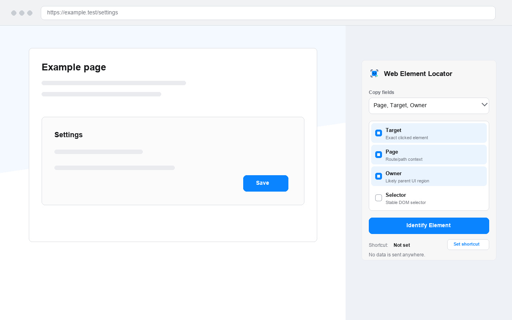

# Web Element Locator

Chrome extension that lets you click any visible element on a page and copy a compact locator for it — the kind of description that helps a coding agent find that element in your codebase.

Everything runs locally. The extension makes no network requests.



## Install

Not yet on the Chrome Web Store. To run it now:

1. Open `chrome://extensions` and turn on **Developer mode**
2. Click **Load unpacked** and select this folder

## Use

Click the toolbar icon, pick which fields to copy, then click **Identify Element**. Hover to highlight, click to copy, `Esc` to cancel.

A locator looks like this:

```
page: /settings
target: button text="Save"
owner: form.settings
```

### Keyboard shortcut

The extension ships with **no shortcut bound**, so it can't collide with your existing ones. To set one, open the popup and click **Edit** next to "Shortcut", or go straight to `chrome://extensions/shortcuts` and set **Identify a page element**.

Chrome does not let extensions assign their own shortcuts, so this has to happen on Chrome's own settings page.

## Copy fields

| Field | What it is |
|---|---|
| `target` | The exact clicked element (always included) |
| `page` | Route/path context |
| `owner` | The likely parent UI region |
| `selector` | A stable DOM selector |
| `html` | Short opening tag / excerpt |
| `position` | Viewport box coordinates |

Your selection is saved in `chrome.storage.local`.

## Develop

```sh
python3 tests/run_payload_snapshots.py   # payload snapshot tests
./scripts/package-webstore.sh            # build dist/ zip
```

The snapshot tests drive real Chrome. If Chrome is already running, pass an isolated profile so the launch doesn't hand off to the existing instance.

## Privacy

No data leaves your machine. See the [privacy policy](docs/privacy-policy.md).

## License

MIT — see [LICENSE](LICENSE).
